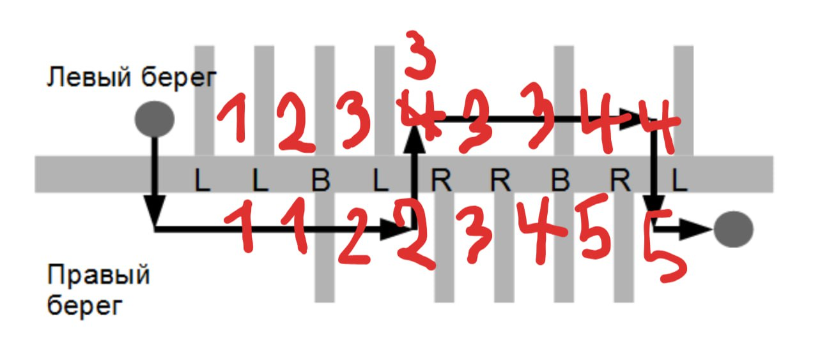
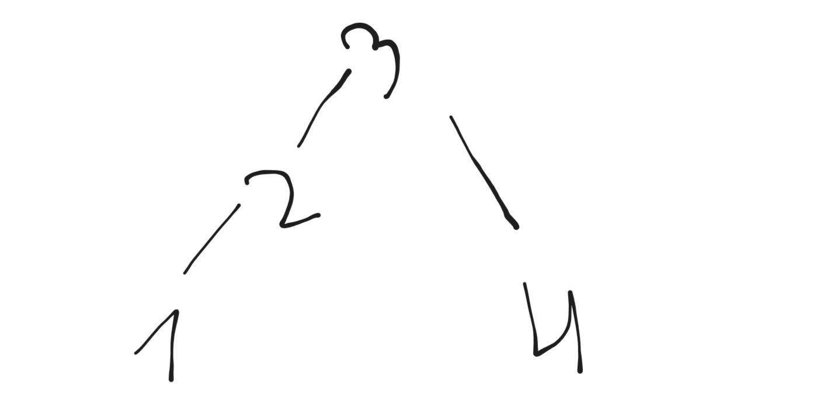
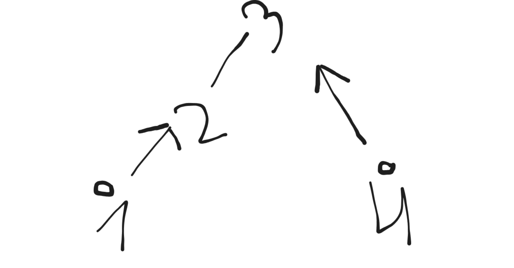
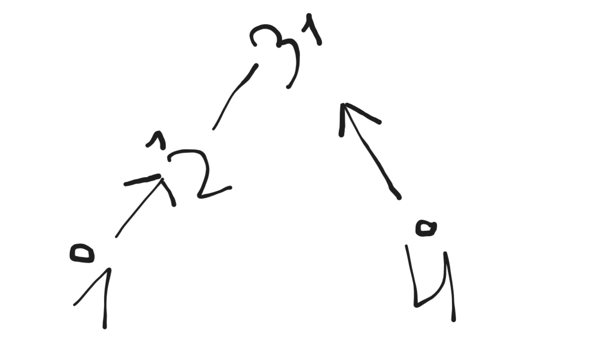
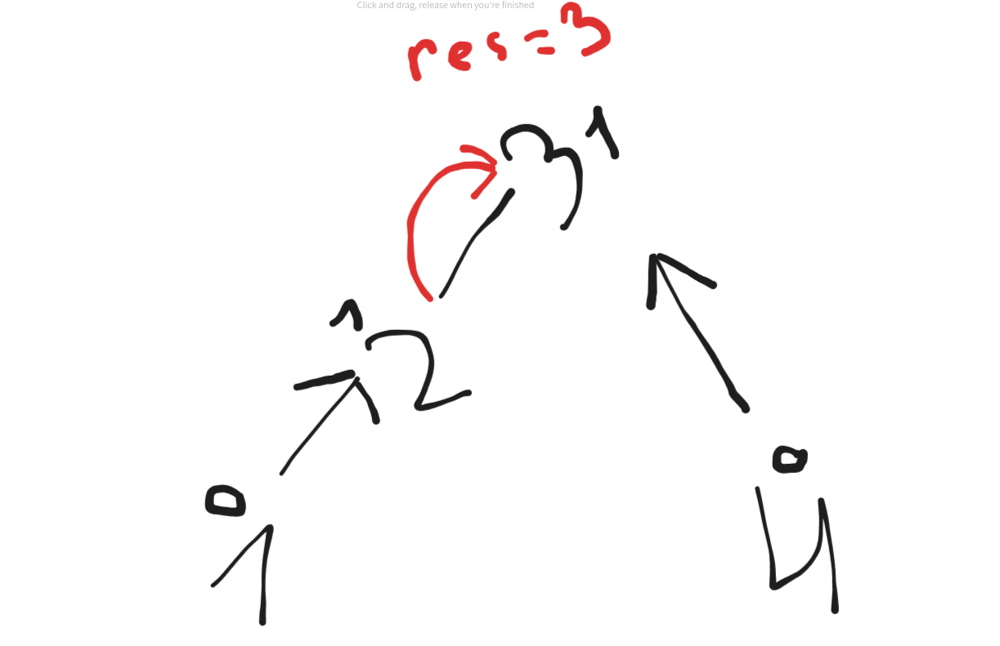
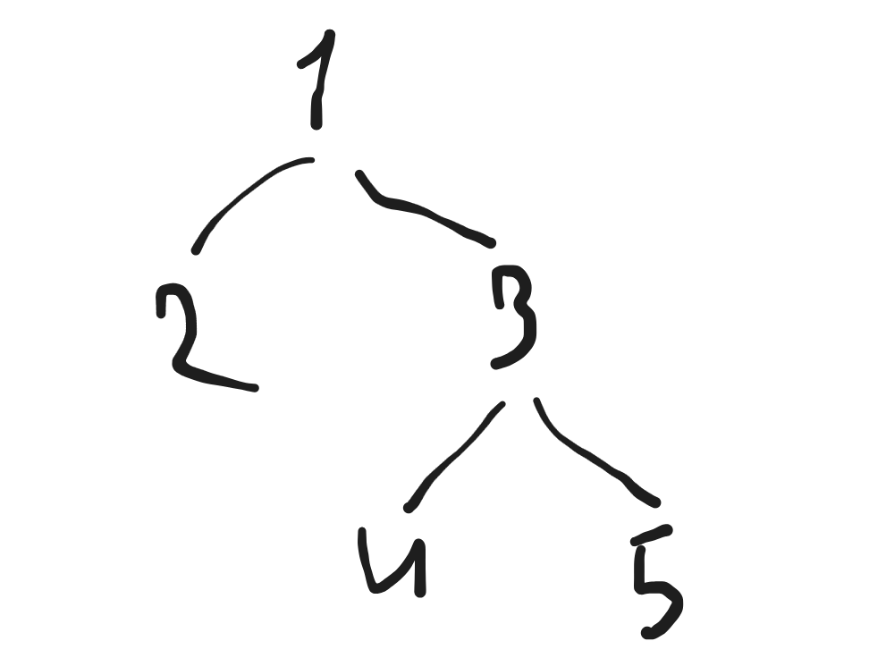
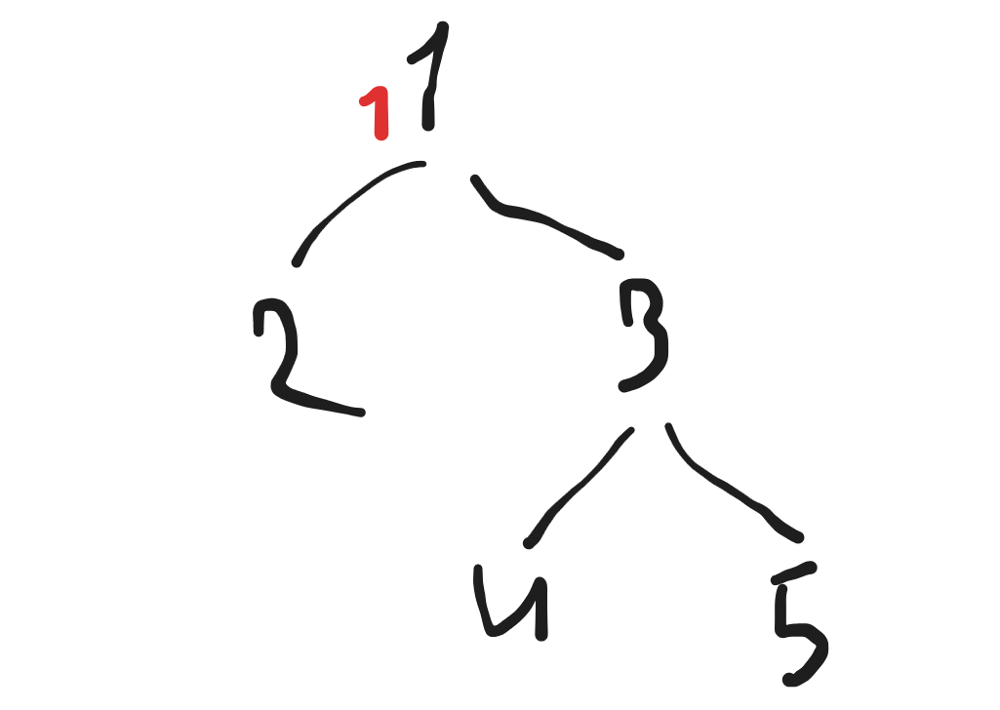
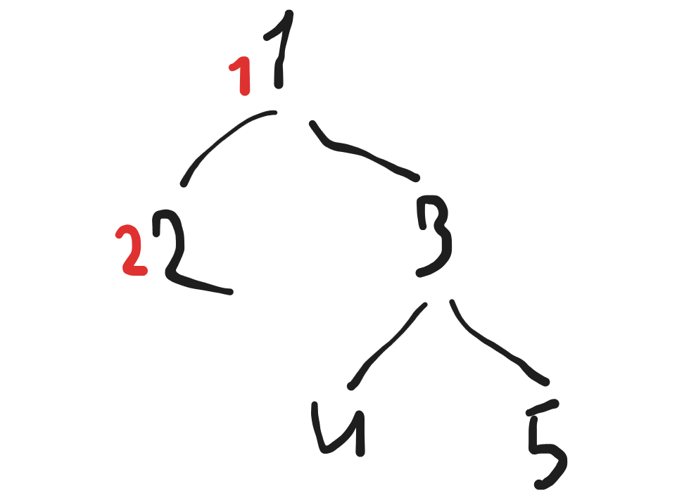
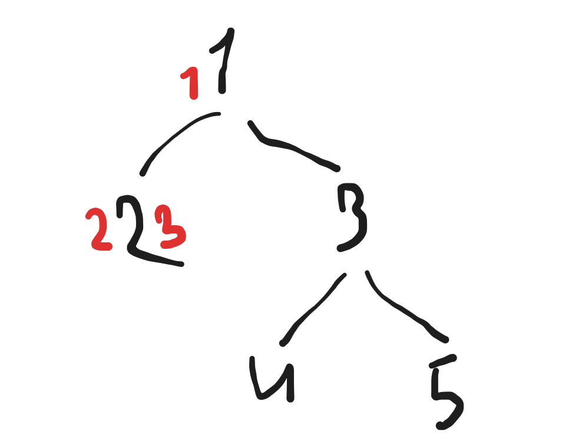
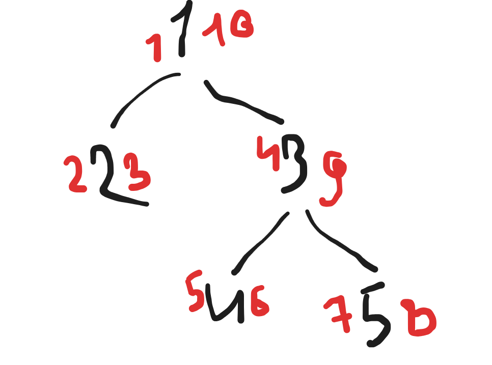

# Leetcode
[My leetcode profile](https://leetcode.com/u/maratsaifutdinov22/).

## Top 75 LeetCode Questions

- [x] Array
    - [x] [Two Sum](https://leetcode.com/problems/two-sum/)
    - [x] [Best Time to Buy and Sell Stock](https://leetcode.com/problems/best-time-to-buy-and-sell-stock/)
    - [x] [Contains Duplicate](https://leetcode.com/problems/contains-duplicate/)
    - [x] [Product of Array Except Self](https://leetcode.com/problems/product-of-array-except-self/)
    - [X] [Maximum Subarray](https://leetcode.com/problems/maximum-subarray/)
    - [X] [Maximum Product Subarray](https://leetcode.com/problems/maximum-product-subarray/)
    - [x] [Find Minimum in Rotated Sorted Array](https://leetcode.com/problems/find-minimum-in-rotated-sorted-array/)
    - [x] [Search in Rotated Sorted Array](https://leetcode.com/problems/search-in-rotated-sorted-array/)
    - [x] [3Sum](https://leetcode.com/problems/3sum/)
    - [x] [Container With Most Water](https://leetcode.com/problems/container-with-most-water/)

- [x] Binary
    - [x] [Sum of Two Integers](https://leetcode.com/problems/sum-of-two-integers/)
    - [x] [Number of 1 Bits](https://leetcode.com/problems/number-of-1-bits/)
    - [x] [Counting Bits](https://leetcode.com/problems/counting-bits/)
    - [x] [Missing Number](https://leetcode.com/problems/missing-number/)
        - Actually used brute force approach: just sorted array and iterated until found a gap.
    - [x] [Reverse Bits](https://leetcode.com/problems/reverse-bits/)
        - **Don't forget** that **to set last bit** of 32-bits signed integer **you need to do** `num |= 1 << 31`, NOT `num |= 1 << 32`. And to set first bit -> `num |= 1 << 0`.

- [x] Dynamic Programming
    - [x] [Climbing Stairs](https://leetcode.com/problems/climbing-stairs/)
    - [x] [Coin Change](https://leetcode.com/problems/coin-change/)
    - [x] [Longest Increasing Subsequence](https://leetcode.com/problems/longest-increasing-subsequence/)
        - **O(n^2) Bottom Up**: 
          - dp[i] = longest combination for nums[i:]
            - to get longest combination for nums[i:] we iterate through dp[:i+1] and nums[i:] to get max dp for num that is bigger than current (if nums[j] > curr then dp[i] = max(dp[i], 1+dp[j]))
          - e.g. we have nums=[1,10,3,1,2]
            - i = 4 (nums[i]=2)
              - dp[4] = 1
            - i = 3 (nums[i]=1)
              - dp[3] = 2 (because nums[3] < nums[4])
            - i = 2 (nums[i]=3)
              - dp[2] = 2
            - i = 1 (nums[i]=10)
              - dp[1] = 1 (because nums[i+1:] are bigger than nums[i])
            - i = 0 (nums[i]=1)
              - dp[0] = 2
          - and then we return max(dp)
    - [x] [Longest Common Subsequence](https://leetcode.com/problems/longest-common-subsequence/)
        - **O(n*m) Bottom Up**: 
          - Make matrix `n` x `m`. Find best solution for `text1[n-1:]` and `text2[m-1:]`, then to `text1[n-2:]` and `text2[m-1:]`, ...
          - If `text1[a]` == `text2[b]`, then best solution for `text1[a:]` and `text2[b:]` is equal to 1 + best solution for `text1[a+1:]` and `text2[b+1:]`
          - Otherwise, the best solution is MAX(best for `text1[a+1:]` and `text2[b:]`, best for `text1[a:]` and `text2[b+1:]`)
    - [x] [Word Break](https://leetcode.com/problems/word-break/)
      - **O(n\*m\*n) Top Down**:
        - If we know that we can reach `s[i]` with words from wordDict, then we find all `s[n]` (n>i) that we can reach with words from wordDict and set `dp[n]=true`
        - 
        - Make `dp[len(s)+1]`. Set `dp[0]=0`.
        - Iterate `i in range(0, len(s))`
          - if `dp[i] == true`
            - iterate through wordDict and if `s[i:].startswith(wordDict[j])`, then set `dp[i + len(wordDict[j])] = true`
        - Return `dp[len(s)+1]`
      - **O(n\*m\*n) Bottom Up**:
        - If `s[i].startswith(wordDict[j])` and `dp[i+len(wordDict[j])] == true`, then `dp[i] == true`
    - [x] [Combination Sum IV](https://leetcode.com/problems/combination-sum-iv/)
      - **O(Target*N) Top Down**:
        - Step by step find best solution for 0..Target (`CurrentTarget`) and save it to `dp` Map
        - So, to calculate `dp[i]` you can use previous values `dp[i] += dp.get(CurrentTarget - Num, 0) for Num in Nums`
    - [x] [House Robber](https://leetcode.com/problems/house-robber/)
        - **O(n)**: Overall approach: 
            1. `dp = nums`
            2. for i in range (len(nums) + 2)
               1. `dp[i] += max(dp[i-2], dp[i-3])`
            3. result is `dp[-1]`
    - [x] [House Robber II](https://leetcode.com/problems/house-robber-ii/)
      - **O(n)**:
        - Use previous problem to solve this one
        - `Result = max(original_rob(Nums[1:]), original_rob(Nums[:-1]))`
    - [x] [Decode Ways](https://leetcode.com/problems/decode-ways/)
      - **O(n)**:
        - pseudo code:
            ```python
            for i in range(0, len(str)): # this is general case (think about first letters)
                dp[i] += dp[i-2] if i >= 2 and 1 <= int(s[i-1] + s[i]) <= 26 else 0
                dp[i] += dp[i-1] if s[i] != '0' else 0
            ```
        - idea:
          - if s[i] != '0', then it can represent letter, so to dp[i] we can add all variants of encoding s[:i] (because there is one way to get from s[i-1] to s[i])
          - if 1 <= int(s[i-1] + s[i]) <= 26, then current and previous numbers can represent letters, so to dp[i] we can add all variants of encoding s[:i-1] (because there is one way to get from s[i-2] to s[i])
    - [x] [Unique Paths](https://leetcode.com/problems/unique-paths/)
      - **O(n * m)**:
        - pseudo code:
            ```python
            for M in range(m):
              for N in range(n):
                dp[N][M] = dp[n-1][m] + dp[n][m-1]
            return [n-1][m-1]
            ```
        - idea:
          - for every cell in first row *number of paths* is equal to one, so we make list [1] * n
          - for next rows: *number of paths* is equal to *number of paths* for upper cell + *number of paths* for left cell
          - return *number of paths* for last cell
    - [x] [Jump Game](https://leetcode.com/problems/jump-game/)
      - **O(n)**:
        - idea:
          - while iterating through array, update `max_inx` value which stores maximum index you can reach. if `i > max_inx`, then return false. if `max_inx >= len(nums)-1`, return true.

- [x] Graph
    - [x] [Clone Graph](https://leetcode.com/problems/clone-graph/)
      - If `s == NULL`, then just return NULL
      - Make `struct Node* arr[101]` to store all processed nodes
      - Then iterate through neighbors nodes starting from s (DFS):
        - If node is already in `arr`, then return it
        - Otherwise, add node to `arr` and start to iterate though its neighbours... 
    - [x] [Course Schedule](https://leetcode.com/problems/course-schedule/)
      - Make a dict `PreMap` and use course for key and list of prerequisites for value
      - Make set `visited`
      - `dfs` algorithm:
        - If course in `visited`, then return False (because that means that we are in loop which means that to finish course you need to finish this course before which is impossible)
        - If course in `PreMap` and prerequisites is empty list, then return True
        - Add course to `visited` and run `dfs` through each prerequisites of current course.
          - If at least one returns False -> also return False
        - Remove current course from `visited`
        - Set `PreMap[course]=[]` (we already checked that course, so no need to check it again)
      - Run `dfs` for i in range(0, numCourses)
    - [x] [Pacific Atlantic Water Flow](https://leetcode.com/problems/pacific-atlantic-water-flow/)
      - Start from Pacific borders and iterate like this:
        - If `r` not out of boundaries AND `c` not out of boundaries AND `(r,c)` not in `CanReachPacific` AND `heights[r][c]` <= `heights[prev_r][prev_c]`
          - Add `(r,c)` to `CanReachPacific`
          - Iterate through `(r+1,c)` 
          - Iterate through `(r-1,c)` 
          - Iterate through `(r,c+1)` 
          - Iterate through `(r,c-1)` 
      - Repeat same thing with Atlantic
      - Find `CanReachPacific` and `CanReachAtlantic` intersections and return them
    - [x] [Number of Islands](https://leetcode.com/problems/number-of-islands/)
      - with all r (0..gridSize) and c (0..gridColSize) combinations:
        - if grid\[r\]\[c\] == 1  ->
          - res += 1
          - Set all cells of island to zero, so, we won't explore this island second time.
    - [x] [Longest Consecutive Sequence](https://leetcode.com/problems/longest-consecutive-sequence/)
      - Make set `numsSet` with `nums`
      - Iterate through `numsSet` and find begginging of sequence
        - Set `length` to zero
        - Start `while` loop (while num+length in numsSet)
          - length++;
        - Compare best length with this length
        - Return best length
    - [x] [Alien Dictionary (Premium)](https://leetcode.com/problems/alien-dictionary/)
      - Make a dict[char: set], where set includes `chars` bigger than `char`. e.g. if `["ab", "ac"]`, then dict should be `{"b": {"c"}}`
      - Use post-order DFS to get the result
        - Iterate through nodes until found graph with no further nodes. Add it to res. Then add its parents to res, then their parents...
        - After iteration is done, reverse the result list
        - IMPORTANT NOTE: if loop if found, then algorithm should return ""
      - return reversed result   list
    - [x] [Graph Valid Tree (Premium)](https://leetcode.com/problems/graph-valid-tree/)
      - There are 2 conditions for valid Tree:
        - Graph should be interconnected
        - Graph should not contain loops
      - Make dict `adj` for each `edge` in `edges`:
        - `adj[edge[0]].append(edge[1])`
        - `adj[edge[1]].append(edge[0])`
      - make `visited set`
      - Dfs:
        - if `element` in `visited`: `return False` (**loop detection!**)
        - `visited.add(element)`
        - iterate through `neighbors` (through `adj[element]`)
          - if `neighbor` != `prev_dfs_val`
            - **Explanation of "`neighbor` != `prev_dfs_val`": `prev_dfs_val` (the edge from which we came to current edge) is in visited, so, if we run dfs for `prev_dfs_val` again, we will get false-positive loop detection and return False**
            - if `(dfs(element=neighbor, prev_dfs_val=element, visited, nodes) == False)`: `return False`
        - return True
      - Note: **the main function should call `dfs` only once**, because if graph is interconnected, then you can find ALL edges starting from any edge in graph. For example:
        - ```
          Node1 - Node2 - Node4
                        - Node5
                - Node3
          # from any node i can get to any node. For example, let's start from Node5:
            - Node5->Node4->Node2->Node1->Node3
          ```
        - ```
          Node1 - Node2 - Node4
                        - Node5
                - Node3
          
          Node7 - Node8
          # we never can get to Node3 if we start from Node7 or Node8, 
          ```
      - return dfs(0, -1, visited, nodes) && n == len(visited)
      - **Explanation:** during dfs we find loops (if element was visited twice -> return False) and by `n == len(visited)` we check that graph is interconnected (if graph isn't interconnected -> `dfs` won't visit all edges)
    - [x] [Number of Connected Components in an Undirected Graph (Premium)](https://leetcode.com/problems/number-of-connected-components-in-an-undirected-graph/)
        - Very similar to [Number of Islands](https://leetcode.com/problems/number-of-islands/)
        - **O(V + E) (V - num of vertices, E - num of edges)**
          - **Important note!** **The node may NOT BE PRESENT IN edges.** So, this situation is possible: `edges=[0,1], n = 4`, it can be illustrated like this:
            ```
            Node0 - Node1

            Node2

            Node3

            Node4
            ```
          - So, `adj={i: [] for i in range(n)}`
          - Then we fill `adj`. `for edge in edges`:
            - `adj[edge[0]].append(edge[1])` 
            - `adj[edge[1]].append(edge[0])`
          - DFS algorithm (`args: int i, dict[int,list[int]] adj`):
            - **Explanation: when we get i, we delete all nodes connected with i**
            - If `i not in adj` (this node was already explored)
            - `neighbors = adj.pop(i)`
            - `for neighbor in neighbors`:
              - `DFS(neighbor, adj)`
          - `res = 0`
          - `for i in range(0, n):`
            - `if i in adj:` (if this group of connected nodes wasn't explored)
              - `res+=1`
              - `DFS(i, adj)` (remove all connected nodes)
          - `return res`
- [ ] Interval
    - [x] [Insert Interval](https://leetcode.com/problems/insert-interval/)
      - **O(n):**
        - [My explanation on leetcode](https://leetcode.com/problems/insert-interval/solutions/7231294/erlangpython-explanation-mem-on-time-on-skvbr/)
        - Input interval consists of 3 parts (but sometimes **not all parts are present**):

          | |       Part1      |  Part2  |    Part3   | 
          |-  |       -      |  -  |    -   | 
          | **Condition** |       `Intervals[i][1] < NewInterval[0]`      |  `NOT Part1 AND NOT Part3` |   `NewInterval[1] < Intervals[i][0]`  | 
          | **Action** | `res.add(Intervals[i])` | `NewInterval = [min(NewInterval[0], Interval[i][0])`, <br/> `max(NewInterval[1], Interval[i][1])]` | `res.add(NewInterval)`, **RETURN** `res + Intervals[i:]` |
          |**Explanation**| We need all intervals that are smaller than NewInterval, so add all of them | We merge overlapping intervals | We insert NewInterval just before the part where all intervals are bigger than NewInterval |
      - *Possible optimizations*:
        - It is possible to solve this problem *in-place* (not create new list, but update input list). It would be **O(1) space complexity** 
        - Also, with *binary search* it is possible to find all three parts. It would be **O(log n) time complexity**.
    - [x] [Merge Intervals](https://leetcode.com/problems/merge-intervals/)
      - **time - O(Nlogn), space - O(N)**
        - Sort input `intervals`
        - Initialize integers `Start, End` = `interval[0][1], interval[0][1]`
        - Iterate through `intervals`:
          - if `intervals[i][0] <= Start` -> `End = MAX(End, intervals[i])`
          - else -> add `[Start, End] to res`, set `Start, End = intervals[i][0], intervals[i][1]`
        - add `[Start, End] to res`
        - return `res`
    - [x] [Non-overlapping Intervals](https://leetcode.com/problems/non-overlapping-intervals/)
      - **time - O(N log N), space - O(1)**
        - Sort input `intervals`
        - Save `prev_end = intervals[0][1]`
        - Iterate through sorted `intervals[1:]`:
          - if intervals[i][0] >= prev_end (*if doesn't overlap with prev interval*):
            - `prev_end = intervals[i][1]`
          - else (*interval overlaps with prev interval*):
            - `res += 1` (*need to remove some interval in any case*)
            - `prev_end = min(prev_end, intervals[i][1])` (*save interval with smallest `prev_end`, because it will overlap with smaller number of intervals*)
    - [x] [Meeting Rooms (Premium)](https://leetcode.com/problems/meeting-rooms/)
      - **time - O(N log N), space - O(1):**
        - Sort `intervals` by `start`
        - Iterate through `intervals`
          - If `prev interval end` is bigger than `current interval start` -> `return false`
        - `return true` 
    - [ ] [Meeting Rooms II (Premium)](https://leetcode.com/problems/meeting-rooms-ii/)

- [ ] Linked List
    - [x] [Reverse Linked List](https://leetcode.com/problems/reverse-linked-list/)
      - Each `value` of reversed list node is `value` of head, each `next` - previously accumulated reversed list
    - [ ] [Detect Cycle in a Linked List](https://leetcode.com/problems/linked-list-cycle/)
    - [x] [Merge Two Sorted Lists](https://leetcode.com/problems/merge-two-sorted-lists/)
    - [ ] [Merge K Sorted Lists](https://leetcode.com/problems/merge-k-sorted-lists/)
    - [ ] [Remove Nth Node From End of List](https://leetcode.com/problems/remove-nth-node-from-end-of-list/)
    - [ ] [Reorder List](https://leetcode.com/problems/reorder-list/)

- [ ] Matrix
    - [ ] [Set Matrix Zeroes](https://leetcode.com/problems/set-matrix-zeroes/)
    - [ ] [Spiral Matrix](https://leetcode.com/problems/spiral-matrix/)
    - [ ] [Rotate Image](https://leetcode.com/problems/rotate-image/)
    - [ ] [Word Search](https://leetcode.com/problems/word-search/)

- [ ] String
    - [ ] [Longest Substring Without Repeating Characters](https://leetcode.com/problems/longest-substring-without-repeating-characters/)
    - [ ] [Longest Repeating Character Replacement](https://leetcode.com/problems/longest-repeating-character-replacement/)
    - [ ] [Minimum Window Substring](https://leetcode.com/problems/minimum-window-substring/)
    - [x] [Valid Anagram](https://leetcode.com/problems/valid-anagram/)
    - [ ] [Group Anagrams](https://leetcode.com/problems/group-anagrams/)
    - [x] [Valid Parentheses](https://leetcode.com/problems/valid-parentheses/)
    - [ ] [Valid Palindrome](https://leetcode.com/problems/valid-palindrome/)
    - [ ] [Longest Palindromic Substring](https://leetcode.com/problems/longest-palindromic-substring/)
    - [ ] [Palindromic Substrings](https://leetcode.com/problems/palindromic-substrings/)
    - [ ] [Encode and Decode Strings (Premium)](https://leetcode.com/problems/encode-and-decode-strings/)

- [ ] Tree
    - [x] [Maximum Depth of Binary Tree](https://leetcode.com/problems/maximum-depth-of-binary-tree/)
    - [ ] [Same Tree](https://leetcode.com/problems/same-tree/)
    - [x] [Invert Binary Tree](https://leetcode.com/problems/invert-binary-tree/)
    - [ ] [Binary Tree Maximum Path Sum](https://leetcode.com/problems/binary-tree-maximum-path-sum/)
    - [ ] [Binary Tree Level Order Traversal](https://leetcode.com/problems/binary-tree-level-order-traversal/)
    - [ ] [Serialize and Deserialize Binary Tree](https://leetcode.com/problems/serialize-and-deserialize-binary-tree/)
    - [ ] [Subtree of Another Tree](https://leetcode.com/problems/subtree-of-another-tree/)
    - [ ] [Construct Binary Tree from Preorder and Inorder Traversal](https://leetcode.com/problems/construct-binary-tree-from-preorder-and-inorder-traversal/)
    - [ ] [Validate Binary Search Tree](https://leetcode.com/problems/validate-binary-search-tree/)
    - [ ] [Kth Smallest Element in a BST](https://leetcode.com/problems/kth-smallest-element-in-a-bst/)
    - [ ] [Lowest Common Ancestor of a BST](https://leetcode.com/problems/lowest-common-ancestor-of-a-binary-search-tree/)
    - [ ] [Implement Trie (Prefix Tree)](https://leetcode.com/problems/implement-trie-prefix-tree/)
    - [ ] [Add and Search Word](https://leetcode.com/problems/add-and-search-word-data-structure-design/)
    - [ ] [Word Search II](https://leetcode.com/problems/word-search-ii/)

- [ ] Heap
    - [ ] [Merge K Sorted Lists](https://leetcode.com/problems/merge-k-sorted-lists/)
    - [ ] [Top K Frequent Elements](https://leetcode.com/problems/top-k-frequent-elements/)
    - [ ] [Find Median from Data Stream](https://leetcode.com/problems/find-median-from-data-stream/)

## Notes
I think I should go back and solve this questions again:
- [ ] Array
  - [ ] [3Sum](https://leetcode.com/problems/3sum/). Cheated for this question.
  - [ ] [Maximum Product Subarray](https://leetcode.com/problems/maximum-product-subarray/)
- [ ] Binary
    - [ ] [Sum of Two Integers](https://leetcode.com/problems/sum-of-two-integers/). Cheated for this question.
- [ ] Dynamic Programming
    - [ ] [Coin Change](https://leetcode.com/problems/coin-change/)
    - [ ] [Longest Increasing Subsequence](https://leetcode.com/problems/longest-increasing-subsequence/)
    - [ ] [Longest Common Subsequence](https://leetcode.com/problems/longest-common-subsequence/). Cheated.
    - [ ] [Word Break](https://leetcode.com/problems/word-break/). Cheaaated. However, i watched Bottom-Up solution, but implemented Top-down, so it's just half cheating
    - [ ] [Combination Sum IV](https://leetcode.com/problems/combination-sum-iv/). I cheated.
- [ ] Graph
    - [ ] [Course Schedule](https://leetcode.com/problems/course-schedule/). Cheated, didn't even rewrite in C or Erlang.
    - [ ] [Pacific Atlantic Water Flow](https://leetcode.com/problems/pacific-atlantic-water-flow/). Even after watched explanation by NeetCode spent about 2 hours to implement. I surely need to come back to this.
    - [ ] [Longest Consecutive Sequence](https://leetcode.com/problems/longest-consecutive-sequence/)
    - [ ] [Alien Dictionary (Premium)](https://leetcode.com/problems/alien-dictionary/)
    - [ ] [Graph Valid Tree (Premium)](https://leetcode.com/problems/graph-valid-tree/)
- [ ] Interval
    - [ ] [Non-overlapping Intervals](https://leetcode.com/problems/non-overlapping-intervals/description/)

Also, I think I can find better approach for this problems:
- [ ] [Missing Number](https://leetcode.com/problems/missing-number/)


## Other algorithms
- [ ] [Designs](https://leetcode.com/problem-list/design/). There are some cool deisgns, explore them, I think it will help on interviews. 
  - [ ] [LRU cache](https://leetcode.com/problems/lru-cache/description/)
  - [ ] [Shuffle an Array](https://leetcode.com/problems/shuffle-an-array/description/)
  - ... explore and find some other cool designs to implement

## BFS
- [ ] solve several algorithms with BFS, not DFS

## Divide and conquer
TODO: also need to solve some **divide and conquer** problems

## Greedy
TODO: also need to solve some **greedy** problems

# Yandex
Solutions can be found in [yandex_trainings](https://github.com/Marat22/algosi/tree/master/yandex_trainings) directory

Explanations
- [x] [A_mushrooms](https://contest.yandex.ru/contest/80939/problems/A/?lang=en)
  - **O(n)**:
    1. find vasya's and masha's sum
    2. find vasya's mushrom with smallest weight and masha's mushroom with biggest weight
    3. if masha's biggest mushroom is bigger than smallest vasya's mushroom, then give mushroom to vasya
- [x] [1_B_mother](https://contest.yandex.ru/contest/80939/problems/B/?lang=en)
  - **O(1)**
    - to solve this task you need dfs or bfs
    - from current state you should try to any possible next_state (if next_state is not in path)
    - if both items are at home -> time = min(best_time, time)
    - state should consist of these elements:
      - curr_location ('d', 'p', 's')
      - items in hands
      - items at home 
- [x] [1_C_cybersecurity](https://contest.yandex.ru/contest/80939/problems/C/?lang=en)
  - **O(n)**: 
    - you can't replace "a" with char "a", so **for each "a" (or any other letter) the number of combinations is the same**.
    - number of combinations in "aabc" is (qty of a) * (qty of other letters), so for "a" it would be 2 * 2 (**b**a**a**c, a**ba**c, **c**ab**a**, a***c***b**a**). then do the same with "bc", then with "c"
    - and don't forget to add 1 to res, because we also should include original password
- [x] [1_D_contest](https://contest.yandex.ru/contest/80939/problems/D/?lang=en)
  - take at least one problem from each theme
  - take any problems until the len(res) == k 
- [x] [1_E_increment](https://contest.yandex.ru/contest/80939/problems/E/?lang=en)
  - for some `z`: if `n mod 10` = `z`, then after `I` iterations `n mod 10` = `z` again. You need to find frequency of such repeations and interval between first and second occurances to calculate the rest.
- [x] [1_F_plus_minus_question](https://contest.yandex.ru/contest/80939/problems/F/?lang=en)
  - Calculate biggest row sum and smallest col sum assuming that `?` is `+` for rows and `?` is `-` for cols. However, **NOTICE** that if `grid[i][j]` = `?`, then 2 should be extracted from `diff`.
- [x] [1_G_5_sequence](https://contest.yandex.ru/contest/80939/problems/G/)
  - **O(i*j)**:
    - for each `(i,j)` save:
      - vertical length `(curRow[j].vert = prevRow[j].vert + 1)`,
      - left to right diagonal length `(curRow[i].from_left_to_right =  prevRow[i-1].from_left_to_right +1)`,
      - right to left diagonal length,
      - horizontal length (using `curRow[i-1]`).
      - If some `length == 5`, then print Yes and stop program. If `length == 5` never happened -> print No
- [x] [2_A_ball](https://contest.yandex.ru/contest/80940/problems/H/?lang=en)
  - **O(i)**:
    - `steps[0] = 0, steps[1] = 1, steps[2] = 2, steps[3] = 4, steps[i] = steps[i-3] + steps[i-2] + steps[i-1]`
    - `return steps[N]`
- [x] [2_B_river](https://contest.yandex.ru/contest/80940/problems/B/?lang=en)
  - 
  - **O(n)**:
    - on each input[i] calc the best way to get to left side and to get to right side
    - e.g. if input[i] == 'l', then
        - best_l = min(prev_l + 1, prev_r+1)
        - best_r = min(prev_l+1, prev_r)
        - prev_l, prev_r = best_l, best_r
- [x] [2_C_intervals](https://contest.yandex.ru/contest/80940/problems/C/?lang=en)
  - **O(N * log(n))**
- [x] [2_D_dictionary](https://contest.yandex.ru/contest/80940/problems/D/?lang=en)
  - **O(len(word) * len(word_dict))**:
    - every time when `word[i:].startswith(word_dict[j])`, we do this `dp[i + len(word_dict[j])].append(copy(dp[i][0]) + [j])`.
    - e.g. we have input string "joja" and word_dict: "joj", "jo", "ja":
      - dp = [[], [], [], [], []]
      - i = 0 ("joja")
        - j = 0 ("joj")
          - "joja"[i:].startswith("joj"), so now dp becomes:
            - dp = [[], [], [], [0], []]
        - j = 1 ("jo")
          - "joja"[i:].startswith("jo"), so now dp becomes:
            - dp = [[], [], [1], [0], []]
        - j = 2 ("ja")
          - "joja"[i:].startswith("jo") is false, so we don't update dp
      - i = 1 ("oja")
        - there is no matching word from worddict for "joja"[i:]
      - i = 2 ("ja")
        - j = 2 ("ja")
          - "joja"[i:].startswith("jo"), so now dp becomes:
            - dp = [[], [], [1], [0], [1,2]]
            - **STOP HERE**, because we already found solution: [1,2] ("jo ja")
  - *Note: this can be solved O(len(word) * log(word_dict)) if we use binary search to find matching words from word_dict* 
- [x] [2_E_tower](https://contest.yandex.ru/contest/80940/problems/E/?lang=en)
  - **O(N):**
    - Solution can be divided in 2 steps:
      1. make array `towers` where `tower[i]` is safety of tower which last column is `i`
      2. make array `dp` where `dp[i][0]` = best solution of 0..i:
         - `include = include = towers[i] + dp[i-K][0]`
         - `exclude = sorted((val, prev_vals) for val, prev_vals in dp[i-K+1:i+1])[-1]`
         - then we compare exclude and include and make decision
- [x] [2_F_game](https://contest.yandex.ru/contest/80940/problems/F/?lang=en)
  - **O(N):**
    - if cur_line[i] is reachable:
      - cur_line[i] = best_reachable_val_of_previous_raw + (1 if line[i] == 'C' else 0)
    - else
      - cur_line[i] = 0
    - **IMPORTANT:** stop if next row in unreachable:
      ```
      WW.
      .WW  # this one is unreachable
      ```
- [x] [2_G_stairs](https://contest.yandex.ru/contest/80940/problems/G/?lang=en)
  - **O(N^3):**
    - `dp[0][0] = 1`
    - `dp[total][first_row]` = number of possible stairs, which consist of `total` cubes and which first row consists of `first_row` cubes  
    - `dp[total][first_row] = dp[total-first_row][first_row-1] + dp[total-first_row][first_row-2] + ... + dp[total-first_row][1]`. In this way we calculate all possible ways to place cubes when total sum is `total` and there are `first_row` cubes in first row
    - But remember that `first_row <= total`
- [x] [2_H_matchsticks](https://contest.yandex.ru/contest/80940/problems/H/?lang=en)
  - **O(1)**:
    - if **1** matchstick is left, then person wins:
      - he wins (can remove 1 last stick)
    - if **2** matchsticks:
      - win (can remove 2 last sticks)
    - if **3** matchsticks:
      - win (can remove 3 last sticks)
    - if **4** matchsticks:
      - loss (no matter how many matchsticks you take - opponent will win)
    - if **5 or 6 or 7**:
      - win (because can remove sticks and get 4 which means that opponent will lose)
    - if **8**:
      - loss (because can't remove enough sticks to get to number where opponent will lose)
    - as we can see the if `N % 4 == 0`, then person loses
- [x] [2_I_chain](https://contest.yandex.ru/contest/80940/problems/I/?lang=en)
- [x] [2_J_masquerade](https://contest.yandex.ru/contest/80940/problems/J/?lang=en)
  - **O(L * N * Fmax):**
    - `dp[s][k] = best(Cost(k ,t) + dp[s-t][k-1] for t in 0..F[k])`
      - so we calculate best cost for `s` meters and `k`th house using previous results
    - however, sometimes `t` can be >= than `s`. In that case we do this: `dp[s][k] = min(dp[s][k], Cost(k, t))`
      - so if the best variant is to just buy more or equal to `s` meters in shop `k`, then buy it in shop `k`
    <!-- - `for s in range(L+1)` -->
    <!-- - `dp[s][k] = best price for s meters and 0..k shops` -->
- [x] [3_A_shelf](https://contest.yandex.ru/contest/80941/problems/A/?lang=en)
- [x] [3_B_from_dead_end_to_dead_end](https://contest.yandex.ru/contest/80941/problems/B/?lang=en)
  - **i don't know complexity, but it's pretty fast:**
    - gradually simultaniously explore all nodes starting from leaf nodes. Example:
      - Tree:
        
      - Mark that the fastest way to get to leaf nodes takes 0 steps:
      
      - Mark neighbor nodes with fastest way to get to them:
      
      - When exploring next neighbor of `2` we find that it is already explored. So, we found the result: 1-2 path + 2-3 path + best path to 3 = 1 + 1 + 1 = 3
      
- [x] [3_C_advertisement](https://contest.yandex.ru/contest/80941/problems/C/?lang=en)
  - **O(log(n) * n):**
    - By binary search find matching k
    - I used brute force algorithm to check if k matches. Since I used C++, I didn't really care about optimization of this thing 🙂
- [x] [3_D_currency_exchange](https://contest.yandex.ru/contest/80941/problems/D/?lang=en)
  - sort `tables` and save values like this `[ [val1, orig_idx1],  [val2, orig_idx2] ]`. in this way it would be easier to determine original indexes for answer.
  - iterate with `i` through sorted tables
    - `target = P / val_i`
    - with binary search find best `j` for this `target` **WHICH IS NOT EQUAL TO i**
    - if `val_i / val_j` is smaller than `best_ratio`, then save original indexes of those values as **best indexes**
  - print **best indexes**
- [x] [3_E_feudalism](https://contest.yandex.ru/contest/80941/problems/E/?lang=en)
- [x] [3_F_ancestor](https://contest.yandex.ru/contest/80941/problems/F/?lang=en)
  - Iterate through nodes. Before entering node, save current time, after exploring node, also save time. Like this:
    - The tree:
    
    
    - Save time before entering. Start with root node:
    
    - Explore children nodes:
    

    - Save time after node is processed:
    

    - Do the same with the rest
    
  - After we explored all nodes we can easily determine if the node is parent or not. `2nd` node is child of `1st`, because 1-10 interval includes 2-3. However `3rd` node is not parent of `2nd`, because 2-3 interval is **not** inside 4-9 interval.
- [x] [3_G_gravity](https://contest.yandex.ru/contest/80941/problems/G/?lang=en)
- [x] [3_H_pickup](https://contest.yandex.ru/contest/80941/problems/H/?lang=en)
- [x] [3_I_expression_tree](https://contest.yandex.ru/contest/80941/problems/I/?lang=en)
- [x] [3_J_interviews](https://contest.yandex.ru/contest/80941/problems/J/?lang=en)
- [x] [4_A_office_trips](https://contest.yandex.ru/contest/80942/problems/A/)
  - Iterate through all seconds since 00:00 till 23:59
    - Process 2 stations:
      - If trip starts at current second:
        - If any bus on current station, then use it AND don't forget to save that at arrival time on opposite station there should be +1 bus
        - If no available bus on station, then total_buses += 1
      - If there are buses left at current second, then in next second at current station they should be available
- [x] [4_B_car_tax](https://contest.yandex.ru/contest/80942/problems/B/)
  - **O(m * log(n))**:
    - Iterate through cars (`q` vals):
      - with binary search find **index** of greatest `b` (power) that is less than `q` (car's power)
      - take t (`tax`) for this index and multiply it by `q`
      - print result of multiplication
- [x] [4_C_candidates_queue](https://contest.yandex.ru/contest/80942/problems/C/)
  - Use Fenwick tree
- [x] [4_D_friendship_won](https://contest.yandex.ru/contest/80942/problems/D/)
- [x] [4_E_repair_patholes](https://contest.yandex.ru/contest/80942/problems/E/)
- [x] [4_F_train](https://contest.yandex.ru/contest/80942/problems/F/)
- [x] [4_G_series_planning](https://contest.yandex.ru/contest/80942/problems/G/)
- [x] [4_H_boss_bonus](https://contest.yandex.ru/contest/80942/problems/H/)
- [x] [4_I_banner](https://contest.yandex.ru/contest/80942/problems/I/)
- [x] [4_J_autosport](https://contest.yandex.ru/contest/80942/problems/J/)

## Notes
- [ ] 2_C intervals was hard, it would be good practice to solve it again

# Sorting algorithms
[Habr Article](https://habr.com/ru/companies/selectel/articles/851206/?ysclid=mf84ivfgd5676821158)

[More **advanced** sorting algorithms](https://deepwiki.com/itcharge/LeetCode-Py/3.1-sorting-algorithms)

Algorithms:
- [ ] Bubble Sort
- [ ] [Insertion Sort List](https://leetcode.com/problems/insertion-sort-list/description/)
- [ ] Selection Sort
- [ ] Heap Sort
- [ ] Quick Sort
- [ ] Merge Sort

# Data Structures Implementations
[Cool Article about data structures](https://deepwiki.com/itcharge/LeetCode-Py/2-data-structures)

Also, I think before implementing data structures it would be helpful to solve [designs on leetcode](https://leetcode.com/problem-list/design/)

Data Structures:
- [x] Linked list
- [ ] HashMap
- [ ] Queue

# Cool sources
- [ ] [visualgo (supercool visualizations)](https://visualgo.net/en/list?slide=1)
- [ ] [Micheal Sambol (short videos about data structures)](https://www.youtube.com/@MichaelSambol/videos)
- [ ] [Abdul Bari (videos about algorithms and data structures)](https://www.youtube.com/@abdul_bari)
- [ ] [Leetcode patterns](https://seanprashad.com/leetcode-patterns/)
- [ ] [algo.monster (some algo course)](https://algo.monster/)
- [ ] 
